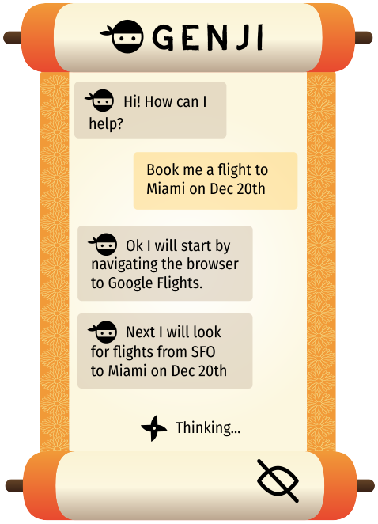

# [Genji](https://genji.app)

Genji is an AI browser assistant that controls your browser to perform the requested tasks. This repo houses the chrome extension codebase that runs on your browser.

## Install (Chrome Web Store)

Install the latest artifact from the [Chrome Web Store](https://chromewebstore.google.com/detail/genji-ai-browser-assistan/jgoncjpgeegjhdecejnfnpjnfmhohgdf)

## Build (Local):

1. `pnpm install`
2. `pnpm build --watch --mode development`
3. Install unpacked extension in chrome
   1. Open `chrome://extensions`
   2. Toggle developer mode
   3. Load Unpacked
   4. Browse to and select the `dist/` folder

## Notes:

- If you don't want the script to run on all pages, change the value of `matches:`
  key in the manifest.json from `<all_urls>` to something like `https://google.com/*`.
- Errors / logs from `Popup.tsx` will appear in the extensions page, NOT the webpage's console.
  This is because the popup code runs in the context of the extension, not the webpage.
